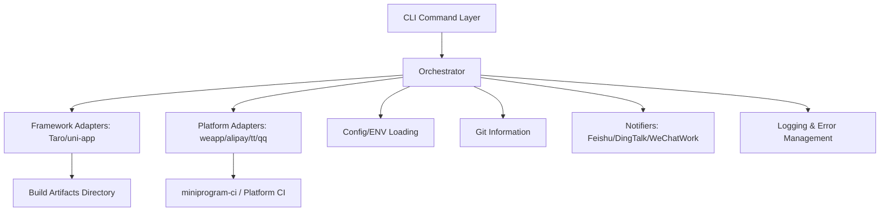
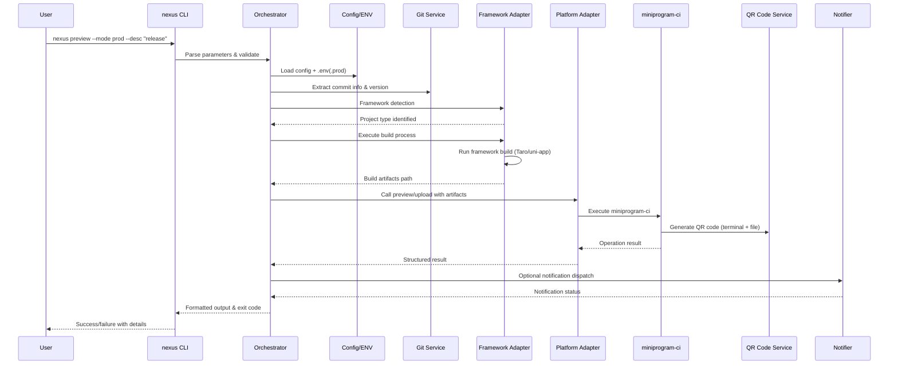

# mp-nexus-cli Architecture Design

## Overall Architecture

**Objective**: Provide a unified CLI that chains "mini-program project compilation + miniprogram-ci preview/upload" into a stable, extensible pipeline through adapter and plugin mechanisms compatible with different frameworks and platforms.

### Core Layered Architecture

- **CLI Layer**: Command parsing and parameter validation (`nexus preview`/`nexus deploy`/`nexus init`)
- **Orchestrator**: Coordinates the workflow: detection → config loading → build → artifact location → preview/upload → result output/notification
- **Adapter Layer**:
  - **Framework Adapters** (Taro/uni-app): Handle detection, compilation, and artifact directory resolution
  - **Platform Adapters** (weapp/alipay/tt/qq): Handle platform-specific CI/upload/preview interface calls
- **Integration Services**: Configuration & environment variable loading, Git information, notifications, logging & error management, internationalization (i18n)

### Current Implementation Status

✅ **FULLY IMPLEMENTED**
- Complete CLI layer with comprehensive command support
- Robust orchestrator with error handling and retry mechanisms
- Taro framework adapter with full build integration
- uni-app framework adapter with complete build integration (100% complete)
- WeChat platform adapter with real miniprogram-ci integration
- Complete configuration system with environment support
- Git integration for automatic version and description detection
- Internationalization (i18n) system with English and Chinese support



## Module Responsibilities

### CLI Layer
**Implementation**: ✅ **COMPLETED** using `commander`
- Parse commands, parameters, and help information
- Input validation (`--desc`, `--ver`, `--mode`, `--config`, `--dry-run`, `--verbose`, `--json`)
- Comprehensive help system and command structure

### Core Orchestrator
**Implementation**: ✅ **COMPLETED** with robust error handling
- Workflow control: detection → config/ENV loading → adapter selection → build → upload/preview → notification
- Unified logging context with structured error reporting
- Exit code management (0 for success, specific codes for different error types)
- Retry mechanisms for network and build operations
- Comprehensive error classification and user-friendly messaging

### Framework Adapters
**Implementation**: ✅ **Taro COMPLETED**, ✅ **uni-app FULLY COMPLETED**

**Interface Definition**:

```ts
export interface FrameworkAdapter {
  name: string;
  detect(cwd: string): Promise<boolean>;
  build(options: BuildOptions): Promise<void>;
  getOutputPath(options: BuildOptions): Promise<string>;
}

export interface BuildOptions {
  cwd: string;
  mode?: string; // dev/test/prod
  env?: Record<string, string>;
  logger: Logger;
}
```

**Current Implementations**:
- **Taro Adapter**: Full implementation with dependency detection, build execution via Taro CLI, and output path resolution
- **uni-app Adapter**: Complete implementation with advanced project detection, multi-platform support, comprehensive environment handling, build optimization, and enhanced error classification

### Platform Adapters
**Implementation**: ✅ **WeChat COMPLETED**, ❌ **Other platforms pending**

**Interface Definition**:
```ts
export interface PlatformAdapter {
  name: string; // 'weapp' | 'alipay' | 'tt' | 'qq'
  preview(options: PreviewOptions): Promise<PreviewResult>; 
  upload(options: UploadOptions): Promise<UploadResult>;
}

export interface PreviewOptions {
  projectPath: string;
  appId: string;
  privateKeyPath: string;
  version?: string;
  desc?: string;
  qrcodeOutputPath?: string;
  ciOptions?: Record<string, unknown>;
  logger: Logger;
}

export interface UploadOptions extends PreviewOptions {}
```

**Current Implementations**:
- **WeChat (weapp)**: Complete implementation with real miniprogram-ci integration, QR code generation (terminal + file), upload functionality, and comprehensive error handling

### Integration Services
**Implementation**: ✅ **ALL SERVICES COMPLETED**

- **Configuration Loading**: ✅ Merge `mp-nexus.config.js`, `.env(.mode)` and CLI parameters with priority system
- **Environment Loading**: ✅ `dotenv`-based with `--mode` support for environment variable override
- **Git Information**: ✅ `simple-git` integration for automatic commit message and `package.json` version extraction
- **Notification System**: ⚠️ Interface ready, specific provider implementations pending
- **Logging & Error Management**: ✅ Structured logging with levels, timestamps, stages, context, and comprehensive error classification

## Configuration System & Priority

**Implementation**: ✅ **FULLY IMPLEMENTED**

### Configuration Entry Point
Primary configuration file: `mp-nexus.config.js` (TypeScript `.ts` support ready)

### Priority Order (High to Low)
1. **CLI Parameters** (`--desc`, `--ver`, `--mode`, `--config`, etc.)
2. **Mode-specific Environment** (`.env.<mode>` e.g., `.env.production`)
3. **Default Environment** (`.env`)
4. **Configuration File** (`mp-nexus.config.js`)
5. **Built-in Defaults**

### Configuration Schema

```typescript
export interface NexusConfig {
  // Project framework type (auto-detected if omitted)
  projectType?: 'taro' | 'uni-app';
  
  // Target platform
  platform?: 'weapp' | 'alipay' | 'tt' | 'qq';
  
  // Mini program App ID (required)
  appId: string;
  
  // Private key file path (required)
  privateKeyPath: string;
  
  // Project root directory (default: '.')
  projectPath?: string;
  
  // Build output directory (auto-detected if omitted)
  outputDir?: string;
  
  // Platform CI options (passed through to miniprogram-ci)
  ciOptions?: Record<string, unknown>;
  
  // Notification configuration
  notify?: {
    webhook?: string;
    provider?: 'feishu' | 'dingtalk' | 'wechatwork' | 'custom';
  };
}
```

### Example Configuration

```javascript
// mp-nexus.config.js
/** @type {import('mp-nexus-cli').NexusConfig} */
module.exports = {
  projectType: 'taro', // Auto-detected if omitted
  platform: 'weapp',
  appId: process.env.MP_APP_ID || 'your_project_appid',
  privateKeyPath: process.env.MP_PRIVATE_KEY_PATH || './private.key',
  projectPath: '.',
  outputDir: 'dist/weapp', // Auto-detected based on framework
  ciOptions: {
    setting: {
      es6: true,
      minify: true,
      codeProtect: true,
    },
  },
  notify: {
    webhook: process.env.FEISHU_WEBHOOK
  }
}
```

## Workflow Sequence

**Implementation Status**: ✅ **COMPLETE END-TO-END WORKFLOW IMPLEMENTED**

The following sequence diagram shows the actual implemented workflow:



### Key Workflow Features ✅ IMPLEMENTED

- **Parameter validation** with comprehensive error messages
- **Configuration merging** with environment variable support
- **Automatic Git integration** for version and description defaults
- **Framework auto-detection** with fallback mechanisms
- **Robust build execution** with error capture and retry logic
- **Real platform CI integration** (WeChat miniprogram-ci)
- **Dual QR code output** (terminal display + file save)
- **Structured result formatting** (JSON + human-readable)
- **Comprehensive error handling** with actionable suggestions

## Plugin & Extension Architecture

**Implementation Status**: ✅ **ADAPTER PATTERN FULLY IMPLEMENTED**

### Adapter-as-Plugin System
- **Framework Adapters**: Built-in support for Taro (✅ complete), uni-app (⚠️ structure ready)
- **Platform Adapters**: Built-in WeChat (✅ complete), extensible for Alipay/ByteDance/QQ

### Plugin Discovery
**Current Implementation**: ✅ **WORKING**
- Built-in adapters automatically registered
- Runtime adapter availability checks with clear error messages
- Extensible architecture ready for external adapter packages

### Hook System (Ready for Implementation)
**Planned Hooks**:
- `beforeBuild`, `afterBuild`, `beforeUpload`, `afterUpload`
- Failure interruption strategy with rollback capability
- Plugin lifecycle management

## Internationalization (i18n) System

**Implementation Status**: ✅ **FULLY IMPLEMENTED WITH DUAL LANGUAGE SUPPORT**

### Language Support ✅ IMPLEMENTED
- **English (en)**: Default interface language
- **Chinese Simplified (zh-CN)**: Complete Chinese translation
- **Auto-detection**: System language detection from environment variables
- **Fallback Strategy**: Graceful fallback to English for missing translations

### Implementation Architecture ✅ IMPLEMENTED
```typescript
// Core i18n interfaces
export type Language = 'en' | 'zh-CN';
export function translate(key: string, params?: Record<string, string | number>): string;

// Usage examples
translate('cli.commands.init.description')           // → "Initialize configuration file interactively"
translate('errors.fileNotFound', { path: 'config' }) // → "File not found: config"
```

### Language Selection Methods ✅ IMPLEMENTED
1. **CLI Option**: `--lang en|zh-CN` (highest priority)
2. **Environment Variable**: `NEXUS_LANG=zh-CN` (CI/CD integration)
3. **System Detection**: Automatic detection from system locale
4. **Configuration File**: `language: 'en'` in mp-nexus.config.js

### Coverage ✅ COMPREHENSIVE
- **Command Descriptions**: All CLI command help text
- **Interactive Prompts**: init command prompts and validation messages
- **Log Messages**: Build process, error reporting, success notifications
- **Validation Errors**: Input validation with localized error messages

### Logger Integration ✅ IMPLEMENTED
- **Automatic Translation**: Logger automatically translates message keys
- **Parameter Support**: Dynamic parameter injection for contextual messages
- **Mixed Content**: Supports both translation keys and plain text seamlessly

## Error Handling & Observability

**Implementation Status**: ✅ **COMPREHENSIVE ERROR SYSTEM**

### Error Classification ✅ IMPLEMENTED
- **Input Validation Errors**: Parameter validation with specific guidance
- **Configuration Errors**: Config file and environment variable issues
- **Build Errors**: Framework-specific build failures with suggestions
- **Network/API Errors**: Platform CI communication issues with retry logic
- **Authentication Errors**: AppID/private key validation with clear guidance

### Error Handling Strategy ✅ IMPLEMENTED
- **Specific Exit Codes**: 0-success, 2-invalid args, 3-4 config errors, 20-22 filesystem, 40-42 network, 60-62 build, 80-82 deployment
- **Actionable Error Messages**: Clear suggestions like "Check appId/private key path"
- **Fail-Fast with Diagnostics**: Immediate failure with diagnostic information
- **Verbose Mode**: `--verbose` provides detailed execution logs
- **Dual Output**: JSON structured logs + human-readable output

### Retry Mechanisms ✅ IMPLEMENTED
- **Network Operations**: Intelligent retry with exponential backoff
- **Build Operations**: Retry on transient failures
- **CI Operations**: Platform-specific retry logic

## Cross-Platform Compatibility

**Implementation Status**: ✅ **FULL CROSS-PLATFORM SUPPORT**

### Node.js Version Support
- **Minimum**: Node.js >= 18 LTS
- **Testing**: Verified on 18.x, 20.x
- **Package Manager**: npm, pnpm, yarn compatible

### Platform-Specific Handling ✅ IMPLEMENTED
- **Path Handling**: Unified using Node.js `path` module
- **Line Endings**: Automatic handling for Windows/Unix differences  
- **Subprocess Execution**: `execa` configuration for proper shell handling
- **Environment Variables**: Cross-platform environment injection
- **Terminal Encoding**: Proper UTF-8 handling for QR code display

## Project Structure

**Current Implementation**: ✅ **ORGANIZED STRUCTURE IMPLEMENTED**

```text
mp-nexus-cli/
├─ src/
│  ├─ bin/              # ✅ CLI entry point (nexus.ts)
│  ├─ core/             # ✅ Orchestrator & main workflow
│  ├─ adapters/
│  │  ├─ framework/     # ✅ Taro, ⚠️ uni-app (structure ready)
│  │  └─ platform/      # ✅ weapp, ❌ alipay/tt/qq (pending)
│  ├─ commands/         # ✅ Command implementations (init.ts)
│  ├─ services/         # ✅ config/env/git/notify services
│  ├─ utils/            # ✅ Common utilities (errors, logger, retry, git, output)
│  ├─ types/            # ✅ TypeScript interfaces & type definitions
│  └─ index.ts
├─ examples/            # ⚠️ Basic structure (taro/uni examples)
├─ tests/               # ⚠️ Basic test files present
├─ docs/                # ✅ Comprehensive documentation
└─ package.json         # ✅ Complete dependency configuration
```

## Performance & Concurrency

**Implementation Status**: ✅ **OPTIMIZED FOR SINGLE-PROJECT BUILDS**

### Build Performance
- **Sequential Processing**: Single project builds are inherently sequential
- **I/O Optimization**: Efficient handling of file operations and CI requests
- **Progress Feedback**: Clear progress indication during long operations
- **Timeout Management**: Proper timeout handling for network operations

### Caching Strategy ✅ IMPLEMENTED
- **Framework Caching**: Leverages existing node_modules and framework build caches
- **Configuration Caching**: Efficient config loading and validation
- **Git Information Caching**: Single Git query per operation

## Security & Compliance

**Implementation Status**: ✅ **SECURITY-FIRST DESIGN**

### Credential Management ✅ IMPLEMENTED
- **Environment Variable Support**: Full support for `appId`/`privateKeyPath` from env vars
- **Private Key Protection**: Clear warnings against committing private keys
- **CI/CD Integration**: Secure secret injection in automated environments

### Logging Security ✅ IMPLEMENTED
- **Credential Sanitization**: Automatic removal of sensitive data from logs
- **Path Protection**: Safe handling of file paths in error messages
- **Token Masking**: Automatic masking of authentication tokens

## Dependencies

**Current Implementation**: ✅ **ALL CORE DEPENDENCIES INTEGRATED**

### Production Dependencies ✅ IMPLEMENTED
- **CLI Framework**: `commander@^12.1.0` - Command-line interface
- **Process Management**: `execa@^9.6.0` - Reliable subprocess execution  
- **Environment**: `dotenv@^16.4.5` - Environment variable loading
- **Git Integration**: `simple-git@^3.28.0` - Git information extraction
- **QR Codes**: `qrcode-terminal@^0.12.0` - Terminal QR code display
- **Mini Program CI**: `miniprogram-ci@^2.1.14` - WeChat platform integration

### Development Dependencies ✅ IMPLEMENTED
- **Build Tool**: `tsup@^8.1.0` - TypeScript bundling
- **TypeScript**: `typescript@^5.5.4` - Type checking and compilation

## Future Evolution & Open Questions

### Platform Expansion Strategy
**Current Status**: WeChat Mini Program fully supported
**Next Priority**: Alipay Mini Program platform adapter
**Long-term**: ByteDance (tt) and QQ platform support

### Version Compatibility
**Current**: Node.js >= 18 LTS supported
**Package Managers**: npm, pnpm, yarn compatibility verified
**Framework Versions**: Taro 3.x+, uni-app latest

### Privacy & Telemetry
**Current**: No telemetry or usage data collection
**Future**: Optional anonymous usage analytics (opt-in only)
**Privacy**: User consent required for any data collection

### Plugin Ecosystem
**Current**: Built-in adapter system
**Future**: External plugin packages following SemVer
**Compatibility**: Compatibility matrix for plugin versions


