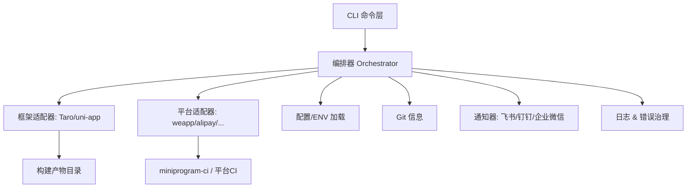
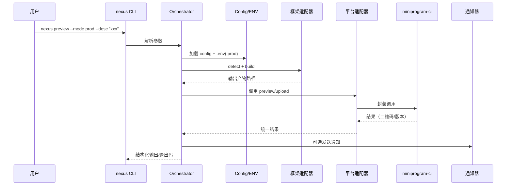

## mp-nexus-cli 架构设计（初稿）

（以下内容来源自原 `docs/项目架构设计.md`，仅更名文件名，内容保持一致以便检索与维护。）

### 一、总体架构

目标：提供统一 CLI，将“小程序项目编译 + miniprogram-ci 预览/上传”串联为一条稳定、可扩展的流水线，并通过适配器与插件机制兼容不同框架与平台。

核心分层：
- CLI 层：命令解析与参数校验（如 `nexus preview`/`nexus deploy`）。
- 编排器（Orchestrator）：串联 检测 → 配置加载 → 构建 → 产物定位 → 预览/上传 → 结果输出/通知。
- 适配器层：
  - 框架适配器（Taro/uni-app/...）：负责检测和编译，以及产物目录解析。
  - 平台适配器（weapp/alipay/...）：负责调用对应平台的 CI/上传/预览接口。
- 集成服务：配置与环境变量加载、Git 信息、通知、日志&错误治理。



---

### 二、模块划分与职责

- CLI 层
  - 解析命令、参数与帮助信息（推荐 `commander` 或 `cac`）。
  - 校验输入（例如 `--desc`、`--ver`、`--mode`、`--config`）。

- 编排器（Core Orchestrator）
  - 顺序控制：检测 → 加载配置/ENV → 选择适配器 → 构建 → 上传/预览 → 通知。
  - 统一日志上下文（traceId、stage），错误捕获与可读报错。
  - 退出码管理（0 成功；非 0 表示不同错误码）。

- 框架适配器（Framework Adapter）
  - detect：识别当前项目类型（检查依赖/配置文件）。
  - build：触发对应框架构建命令（Taro/uni-app），处理跨平台兼容与错误。
  - getOutputPath：解析实际上传所需的产物目录。

```ts
export interface FrameworkAdapter {
  detect(cwd: string): Promise<boolean>;
  build(options: BuildOptions): Promise<void>;
  getOutputPath(options: BuildOptions): Promise<string>;
}

export interface BuildOptions {
  cwd: string;
  mode?: string; // dev/test/prod
  env?: Record<string, string>;
  logger: Logger;
}
```

- 平台适配器（Platform Adapter）
  - 封装平台侧 CI 能力（如 `miniprogram-ci` 的 preview/upload）。
  - 处理平台差异（如 weapp/alipay 的鉴权、配置、文件清单等）。

```ts
export interface PlatformAdapter {
  name: string; // 'weapp' | 'alipay' | ...
  preview(options: PreviewOptions): Promise<PreviewResult>; 
  upload(options: UploadOptions): Promise<UploadResult>;
}

export interface PreviewOptions {
  projectPath: string;
  appId: string;
  privateKeyPath: string;
  version?: string;
  desc?: string;
  qrcodeOutput?: string; // 终端二维码/文件路径
  logger: Logger;
}

export interface UploadOptions extends PreviewOptions {}
```

- 集成服务
  - 配置加载：合并 `mp-nexus.config.js`、`.env(.mode)` 与 CLI 参数，提供最终配置。
  - ENV 装载：基于 `dotenv` 及 `--mode` 加载覆盖环境变量。
  - Git 信息：基于 `simple-git` 获取最近一次 commit message 与 `package.json` 版本号。
  - 通知器：结果推送到飞书/钉钉/企业微信（可插拔实现）。
  - 日志&错误：结构化日志（等级、时间、stage、上下文），错误分类与建议。

---

### 三、配置约定与优先级

配置入口：`mp-nexus.config.js`（支持 `.ts` 可选）。

优先级（从高到低）：
1. CLI 参数（如 `--desc`、`--ver`、`--mode`、`--config`）
2. `.env.<mode>`（如 `.env.production`）
3. `.env`（默认环境）
4. `mp-nexus.config.js` 默认值

配置示例：

```ts
// mp-nexus.config.js
/** @type {import('./types').NexusConfig} */
module.exports = {
  projectType: 'taro', // 或 'uni-app'，可不填由 detect 自动识别
  platform: 'weapp',
  appId: 'wx1234567890abcd',
  privateKeyPath: './private.key',
  projectPath: '.',
  outputDir: 'dist/weapp',
  ciOptions: {
    // 可透传 miniprogram-ci 的高级配置
  },
  notify: {
    webhook: ''
  }
}
```

```ts
export interface NexusConfig {
  projectType?: 'taro' | 'uni-app';
  platform?: 'weapp' | 'alipay' | string;
  appId: string;
  privateKeyPath: string;
  projectPath?: string; // 项目根目录
  outputDir?: string;   // 产物目录（如 dist/weapp）
  ciOptions?: Record<string, unknown>;
  notify?: {
    webhook?: string;
  };
}
```

---

### 四、关键流程（时序）



---

### 五、插件与扩展机制

- 适配器即插件：
  - 框架适配器：`@nexus/adapter-taro`、`@nexus/adapter-uni`。
  - 平台适配器：`@nexus/platform-weapp`、`@nexus/platform-alipay`。
- 插件发现：
  - 默认内置常用适配器；也可通过配置指定自定义包名。
  - 运行期检查插件可用性，并给出安装建议。
- Hook 约定：
  - `beforeBuild`、`afterBuild`、`beforeUpload`、`afterUpload`。
  - 失败中断策略与回滚约定。

---

### 六、错误处理与可观测性

- 错误类型：输入校验错误、构建错误、CI 调用错误、网络/鉴权错误。
- 处理策略：
  - 明确错误码与建议（如“检查 appId/私钥路径”、“确认小程序 IDE 版本”）。
  - 失败即停，输出诊断信息与重试指引；可选 `--verbose`。
  - 结构化日志（JSON）与人类可读日志双轨输出。

---

### 七、跨平台兼容

- Node 版本矩阵（建议 >= 18 LTS）。
- Windows/macOS/Linux：
  - 路径与换行差异（统一使用 `path`）。
  - 子进程/终端编码（`execa` 配置）。
  - shell quoting 与环境变量注入。

---

### 八、目录结构建议

```text
.
├─ src/
│  ├─ bin/              # CLI 入口（nexus）
│  ├─ core/             # 编排器与主流程
│  ├─ adapters/
│  │  ├─ framework/     # taro、uni 等
│  │  └─ platform/      # weapp、alipay 等
│  ├─ services/         # config/env/git/notify/ci/log
│  ├─ utils/            # 通用工具
│  ├─ types/            # TS 接口类型
│  └─ index.ts
├─ examples/            # 示例项目（taro/uni）
├─ tests/               # 单测/集成测试
├─ docs/                # 文档
└─ package.json
```

---

### 九、性能与并发

- 单项目构建通常是串行；并发关注在 I/O 与 CI 请求等待时的体验（进度与超时）。
- 缓存：可复用 node_modules 与框架缓存；CI 侧二维码与日志缓存按需实现。

---

### 十、安全与合规

- 凭证管理：
  - 支持从环境变量读取 `appId`/`privateKeyPath`；避免将私钥入库。
  - 日志脱敏（路径、token、cookie）。

---

### 十一、依赖建议

- CLI：`commander` 或 `cac`
- 子进程：`execa`
- ENV：`dotenv`
- Git：`simple-git`
- 二维码：`qrcode-terminal`
- CI：`miniprogram-ci`
- 校验：`zod`/`yup`
- 构建：`tsup`/`esbuild`
- 日志：`pino`/`winston`

---

### 十二、开放问题与后续演进

- 率先支持平台范围：仅微信 or 同步上支付宝/字节？
- Node 最低版本与包管理器约束（npm/pnpm/yarn）。
- 遥测与匿名使用数据是否采集（默认关闭）。
- 插件发布与版本兼容策略（SemVer + 兼容矩阵）。


