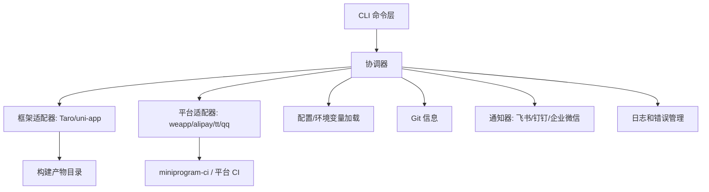

# mp-nexus-cli 架构设计

## 整体架构

**目标**：提供统一的 CLI，通过适配器和插件机制将"小程序项目编译 + miniprogram-ci 预览/上传"链接成稳定、可扩展的管道，兼容不同框架和平台。

### 核心分层架构

- **CLI 层**：命令解析和参数验证（`nexus preview`/`nexus deploy`/`nexus init`）
- **协调器**：协调工作流：检测 → 配置加载 → 构建 → 构建产物定位 → 预览/上传 → 结果输出/通知
- **适配器层**：
  - **框架适配器**（Taro/uni-app）：处理检测、编译和构建产物目录解析
  - **平台适配器**（weapp/alipay/tt/qq）：处理平台特定的 CI/上传/预览接口调用
- **集成服务**：配置和环境变量加载、Git 信息、通知、日志和错误管理、国际化（i18n）

### 当前实现状态

✅ **完全实现**
- 具有全面命令支持的完整 CLI 层
- 具有错误处理和重试机制的健壮协调器
- 具有完整构建集成的 Taro 框架适配器
- 具有完整构建集成的 uni-app 框架适配器（100% 完成）
- 具有真实 miniprogram-ci 集成的微信平台适配器
- 具有环境支持的完整配置系统
- 用于自动版本和描述检测的 Git 集成
- 具有英语和中文支持的国际化（i18n）系统



## 模块职责

### CLI 层
**实现**：✅ **已完成** 使用 `commander`
- 解析命令、参数和帮助信息
- 输入验证（`--desc`、`--ver`、`--mode`、`--config`、`--dry-run`、`--verbose`、`--json`）
- 全面的帮助系统和命令结构

### 核心协调器
**实现**：✅ **已完成** 具有健壮的错误处理
- 工作流控制：检测 → 配置/环境变量加载 → 适配器选择 → 构建 → 上传/预览 → 通知
- 具有结构化错误报告的统一日志上下文
- 退出码管理（成功为 0，不同错误类型有特定代码）
- 网络和构建操作的重试机制
- 全面的错误分类和用户友好的消息

### 框架适配器
**实现**：✅ **Taro 已完成**，✅ **uni-app 完全完成**

**接口定义**：

```ts
export interface FrameworkAdapter {
  name: string;
  detect(cwd: string): Promise<boolean>;
  build(options: BuildOptions): Promise<void>;
  getOutputPath(options: BuildOptions): Promise<string>;
}

export interface BuildOptions {
  cwd: string;
  mode?: string; // dev/test/prod
  env?: Record<string, string>;
  logger: Logger;
}
```

**当前实现**：
- **Taro 适配器**：完整实现，包括依赖检测、通过 Taro CLI 构建执行和输出路径解析
- **uni-app 适配器**：完整实现，包括高级项目检测、多平台支持、全面的环境处理、构建优化和增强的错误分类

### 平台适配器
**实现**：✅ **微信完成**，❌ **其他平台待定**

**接口定义**：

```ts
export interface PlatformAdapter {
  name: string;
  preview(options: PreviewOptions): Promise<PreviewResult>;
  deploy(options: DeployOptions): Promise<DeployResult>;
}
```

**当前实现**：
- **WeChat 平台适配器**：完整实现，包括预览二维码生成、部署上传、错误处理和重试机制

## 国际化（i18n）系统

**实现状态**：✅ **完全实现双语支持**

### 语言支持 ✅ 已实现
- **英语（en）**：默认界面语言
- **中文简体（zh-CN）**：完整的中文翻译
- **自动检测**：从环境变量检测系统语言
- **回退策略**：缺少翻译时优雅回退到英语

### 实现架构 ✅ 已实现
```typescript
// 核心 i18n 接口
export type Language = 'en' | 'zh-CN';
export function translate(key: string, params?: Record<string, string | number>): string;

// 使用示例
translate('cli.commands.init.description')           // → "Initialize configuration file interactively"
translate('errors.fileNotFound', { path: 'config' }) // → "File not found: config"
```

### 语言选择方法 ✅ 已实现
1. **CLI 选项**：`--lang en|zh-CN`（最高优先级）
2. **环境变量**：`NEXUS_LANG=zh-CN`（CI/CD 集成）
3. **系统检测**：从系统区域设置自动检测
4. **配置文件**：mp-nexus.config.js 中的 `language: 'en'`

### 覆盖范围 ✅ 全面
- **命令描述**：所有 CLI 命令帮助文本
- **交互式提示**：init 命令提示和验证消息
- **日志消息**：构建过程、错误报告、成功通知
- **验证错误**：带有本地化错误消息的输入验证

### 日志器集成 ✅ 已实现
- **自动翻译**：日志器自动翻译消息键
- **参数支持**：上下文消息的动态参数注入
- **混合内容**：无缝支持翻译键和纯文本

## 配置系统

**实现**：✅ **已完成** 具有环境支持

### 配置优先级
1. CLI 选项（`--lang`、`--mode`、`--desc`、`--ver`、`--config`）
2. `.env.<mode>` 文件中的环境变量
3. `.env` 文件中的环境变量（包括 `NEXUS_LANG`）
4. `mp-nexus.config.js` 中的值
5. 默认值（语言：从系统自动检测）

### 配置加载流程
```typescript
export interface NexusConfig {
  projectType?: 'taro' | 'uni-app';
  language?: 'en' | 'zh-CN';
  platform?: 'weapp' | 'alipay' | 'tt' | 'qq';
  appId: string;
  privateKeyPath: string;
  projectPath?: string;
  outputDir?: string;
  ciOptions?: Record<string, unknown>;
  notify?: NotifyConfig;
}
```

## 工作流序列

### 预览工作流
1. **解析命令**：处理 CLI 参数和语言设置
2. **加载配置**：合并配置文件、环境变量和 CLI 选项
3. **检测框架**：运行框架适配器检测
4. **构建项目**：使用选定的框架适配器
5. **定位构建产物**：解析输出目录
6. **生成预览**：调用平台适配器预览
7. **显示二维码**：终端输出和文件保存
8. **发送通知**：可选的成功/失败通知

### 部署工作流
1-6. 与预览相同的步骤
7. **上传版本**：调用平台适配器部署
8. **发送通知**：部署结果通知

## 插件架构

### 适配器加载
```typescript
// 动态适配器注册
const frameworkAdapters = [
  new TaroFrameworkAdapter(),
  new UniAppFrameworkAdapter(),
];

const platformAdapters = [
  new WeAppPlatformAdapter(),
  // 未来：new AlipayPlatformAdapter(),
];
```

### 扩展点
- **新框架支持**：实现 `FrameworkAdapter` 接口
- **新平台支持**：实现 `PlatformAdapter` 接口
- **自定义通知**：实现 `NotifierProvider` 接口

## 错误处理

### 错误分类
- **配置错误**（3-4）：配置文件问题
- **文件系统错误**（20-22）：文件访问问题
- **网络错误**（40-42）：API 调用失败
- **构建错误**（60-62）：框架构建失败
- **部署错误**（80-82）：平台上传失败
- **平台特定错误**（100+）：特定平台问题

### 重试机制
```typescript
// 使用指数退避的网络操作重试
await withRetry(
  () => platformAdapter.preview(options),
  { maxRetries: 3, baseDelay: 1000 }
);
```

## 跨平台兼容性

### 支持的操作系统
- **Windows**：完整支持，包括 PowerShell 和 CMD
- **macOS**：完整支持
- **Linux**：完整支持

### 路径处理
- 使用 `path.resolve()` 进行跨平台路径解析
- 环境变量检测适应不同操作系统
- 子进程执行兼容不同 shell 环境

## 项目结构

```
src/
├── adapters/          # 适配器实现
│   ├── framework/     # 框架适配器
│   │   ├── taro/      # Taro 适配器 ✅
│   │   └── uni/       # uni-app 适配器 ✅
│   └── platform/      # 平台适配器
│       └── weapp/     # 微信适配器 ✅
├── bin/               # CLI 入口点
├── commands/          # 命令实现
├── core/              # 核心协调器
├── services/          # 集成服务
├── types/             # TypeScript 类型定义
└── utils/             # 实用工具
    ├── errors.ts      # 错误管理
    ├── logger.ts      # 日志系统
    ├── i18n.ts        # 国际化 ✅
    └── retry.ts       # 重试机制
```

## 性能考虑

### 构建优化
- 并行化适配器检测
- 缓存构建结果
- 增量构建支持（当框架支持时）

### 内存管理
- 流式日志输出
- 按需加载适配器
- 适当的错误边界

## 安全性

### 敏感信息处理
- 私钥文件路径验证
- 环境变量隔离
- 日志中的敏感信息脱敏

### 输入验证
- CLI 参数清理
- 配置文件验证
- 路径遍历防护

## 依赖项

### 核心依赖
- **commander**：CLI 框架
- **execa**：进程执行
- **dotenv**：环境变量
- **simple-git**：Git 集成
- **qrcode-terminal**：二维码显示
- **miniprogram-ci**：微信平台集成
- **inquirer**：交互式提示

### 开发依赖
- **TypeScript**：类型安全
- **tsup**：构建工具
- **Jest**：测试框架

这个架构确保了 mp-nexus-cli 是一个健壮、可扩展且用户友好的工具，能够优雅地处理各种边缘情况，同时为未来的功能扩展提供清晰的路径。
